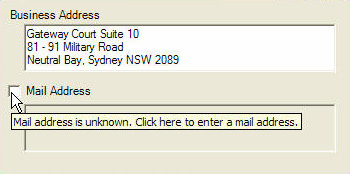

NULLs complicate your life. To avoid having to constantly differentiate between empty strings and NULLs, you should avoid storing NULLS if you can.
Why? Well, what is wrong with this?

<!--endintro-->


```
SELECT ContactName FROM Customer WHERE ContactName <> ''
```


 **Figure: Selecting on empty string
** 
Nothing if your data is perfect, but if you allow Nulls in your database, then statements like this will give you unexpected results. To get it working you would have to add the following to the last line:


```
WHERE ContactName <> '' OR ContactName Is Null
```


 **Figure: Allowing null strings makes queries more complex

** 
What about only allowing empty strings? Well, we choose to block Nulls because it is a lot easier to check off a check box in SQL Server Management Studio than it is to put a constraint on every field that disallows empty string ('').


::: ok  
  
:::

However, you should always be aware that Nulls and empty strings are totally different, so if you absolutely have to have them, they should be used consistently. In the ANSI SQL-92 standard, an empty string ('') is never equated to Null, because empty string can be significant in certain applications.

**Not allowing Nulls will give you the following benefits:**

* Don't have to enforce every text field with a CHECK constraint such as ([ContactName]&lt;&gt;'').
* Make your query simpler, avoid extra checking in stored procedures. So you don't have to check for NULLs and empty strings in your WHERE clause.
* SQL Server performs better when nulls are not being used.
* Don't have to deal with the pain in the middle tier to explicitly check DBNull.Value, you can always use contactRow.ContactName == String.Empty. Database Nulls in the .NET framework are represented as DBNull.Value and it cannot implicitly typecast to ANY other type, so if you are allowing NULLs in ContactName field, the above comparing will raise an exception.
* Avoid other nasty issues, a lot of controls in the .NET framework have real problems binding to DBNull.Value. So you don't have write custom controls to handle this small thing.


For example, you have Address1 and Address2 in your database, a Null value in Address2 means you don't know what the Address2 is, but an empty string means you know there is no data for Address2. You have to use a checkbox on the UI to explicitly distinguish Null value and empty string:


::: ok  
  
:::

Some people are not going to like this rule, but this is how it works in Oracle and Access:

* In Oracle, empty strings are turned into Nulls (which is basically what this rule is doing). Empty strings per se are not supported in Oracle (This is not ANSI compliant).
* And talking of legacy systems :-) be aware that using Access as a data editor is a "No-No". Access turns empty strings into a Null.


Finally, always listen to the client, Nulls have meaning over an empty string - there are exceptions where you might use them - but they are rare.

So follow this rule, block Nulls where possible, update your NULLs with proper information as soon as possible, and keep data consistent and queries simple.
