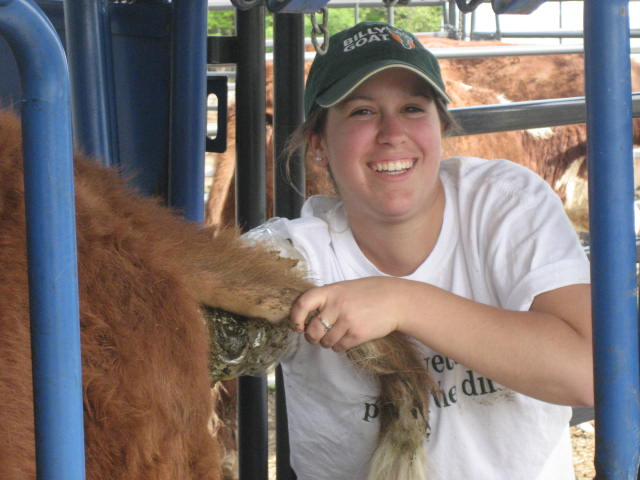

This idea is different from the above rules in that it strikes at the heart of our                     everyday behaviour, not just when a crisis is looming. [Jesus of Nazareth](http://www.biblegateway.com/passage/?search=matt%205:41&version=NKJV%3b) said:

::: greybox

"And whoever compels you to go one mile, go with him two."

:::

While not everyone chooses                     to agree with everything He said, it's a valid point when it came to creating                     a positive team environment. If you're willing to help others above and beyond the                     call of duty, a whole ream of benefits flow:

<!--endintro-->

* People begin to share responsibility for work that traditionally is claimed as "not my problem"
* Others will return the favour when you really need it
* The sense of work-place isolation disappears
* Productivity lifts as tasks can be achieved quicker

 **Figure: Going the extra mile** 
This rule particularly applies when a person is [blocked](/Pages/Ask-questions-where-you-are-stuck.aspx)– as identified in their Daily Scrum.
