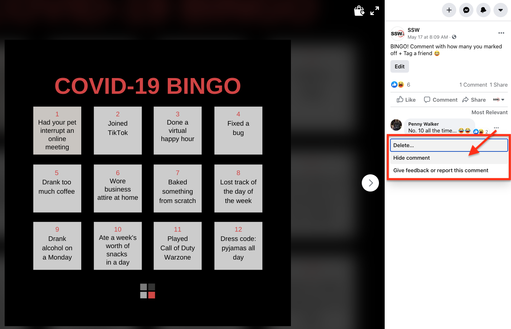
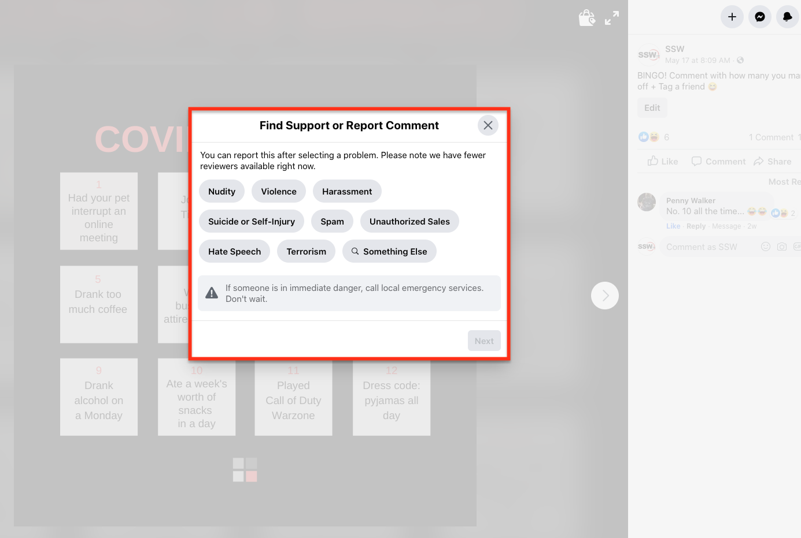

As social media becomes more and more popular and accessible, people leaving comments expressing their opinion about something they saw online is becoming more common.
 
The manner by which companies handle negative and inappropriate comments says a lot about the brand, so managing comments on social media should also reflect the company values. Don’t forget that positive comments should have the same relevance and should be replied to with the same amount of effort.

<!--endintro-->

Here are some points on handling negative comments:

### 1. Don’t block people who don’t agree with you

Unless you’ve received a disrespectful or hateful comment, don’t block users that have a different point of view to yours.

### 2. Understand the situation, apologize and fix the problem

A negative comment could be due to bad customer experience. In that case, first, understand what happened, show in your reply that you are sorry that a certain situation didn’t go as expected and that you understand how your client feels, as     [Neil Patel suggests](https://neilpatel.com/blog/unhappy-customers-into-resource/). Then show your client that you’ve fixed the problem, or that you are working on it (if it’s a long process to fix it). If a customer has raised an issue publicly, addressing it publicly is the way to go as it shows transparency and builds trust with your community. Responding to clients that have had a bad experience with your product or service is crucial on social media to encourage others to keep purchasing from your company.

### 3. If the problem is serious, reach out to the client through a private message

From the first comment, we can identify if a problem can escalate quickly, or if it’s harder to handle publicly. In cases like this, you can ask the client to contact you privately via email or direct message. This will hopefully take the damage offline and allows you to engage with the customer in a more personal way. It also allows other clients to see that you still responded and that you took action on a client's concern.

### 4. Remember that some people are just trolls!

If you got a new comment that is not from a client or a potential client, remember that some people are just trolls and want to make fun of everything. If the customer is unreceptive to your helpful replies or they start posting anything offensive or inappropriate on your page, it is perfectly reasonable to block them – but this should be the last option in most cases. If you can, verify that they actually were a customer of your business using your CRM system. Finally, keep in mind that replying could mean poking the bear, and you’ll only feed their need for attention even more. Some comments could be either about your product/service or about a meme you posted. If you get a discriminatory comment e.g. containing sexism, homophobia or racism, discuss it with your team to see if you should hide, reply, or just ignore it. For more, check [this article from Hootsuite with 9 tips for handling trolls on social media.](https://blog.hootsuite.com/how-to-deal-with-trolls-on-social-media/)

Making sure everyone from your team is on the same page about how to approach these situations is the best way to go.

4. Use a social media management tool

You can use social media monitoring tools to keep track of the comments you get on social media, like Zendesk or Hootsuite.
 **Figure: This is Zendesk UI to help you reply to comments on social media - You can reply, mark as solved, open or pending through the platform** 
**Figure: This is Hootsuite UI to manage comments (more expensive)** **<dl class="ssw15-rteElement-ImageArea"><strong style="background-color:initial;"> </strong> </dl>** 
### 5. Use the hide functionality (Facebook only)

Facebook has a nice functionality where if you hide a comment, the user who posted it (and the page manager) can still see it. This hide functionality is useful as it doesn’t inflame the situation. On other platforms, you have to either publicly comment to indicate that the message is against your company’s values or report the comment to hide it.

::: ok  
  
:::

::: ok  
  
:::
