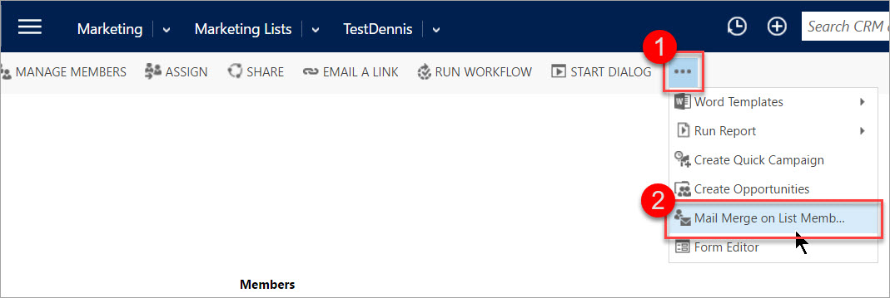
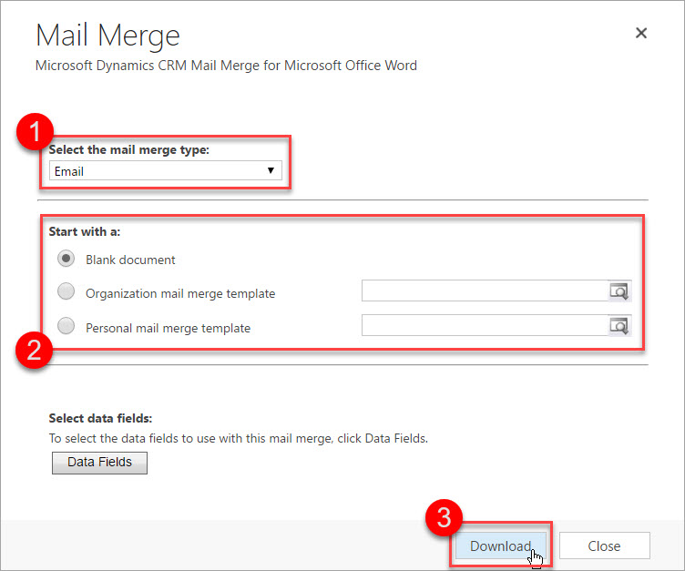
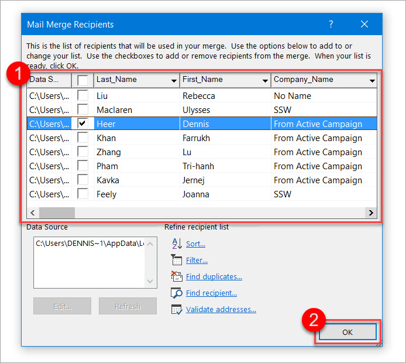
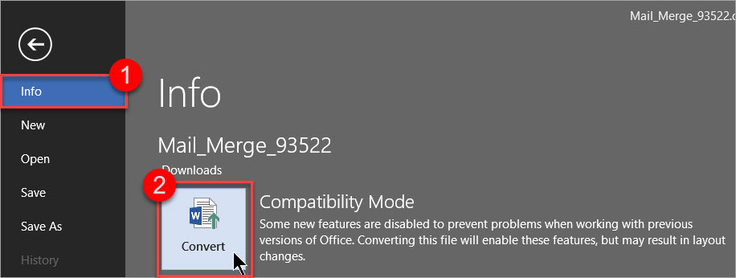
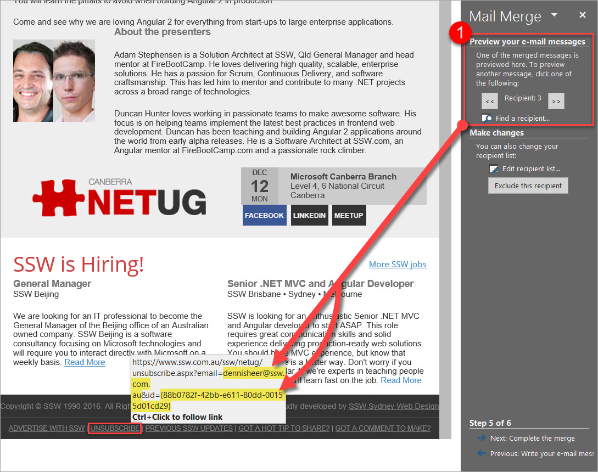
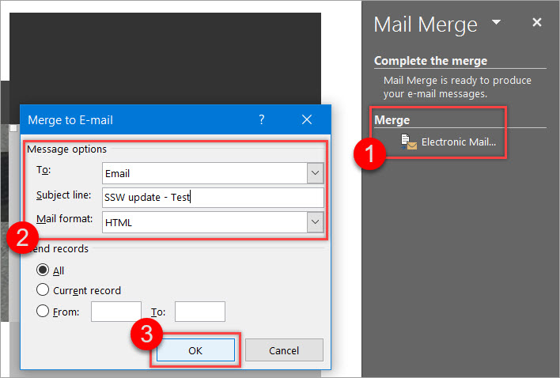

There are different ways of sending newsletters using the Microsoft Dynamics CRM 2016:


* Campaigns
* Quick Campaigns
* Mail Merge on Marketing Lists


This rule will show you how to send a newsletter using the last method, the mail merge.


By default, Microsoft Dynamics CRM 2016 does not come with good functionality on inserting custom unsubscribe links to your newsletters - that's why we are going to look at how to add a custom unsubscribe link in each email. 


<!--endintro-->

Prerequisites:

* [Microsoft Dynamics CRM 2016 for Microsoft Office Outlook (Outlook client)](https://www.microsoft.com/en-au/download/details.aspx?id=50370) is installed and set up
* Microsoft Outlook is running and set up


### Option 1 (recommended)


Basic coding knowledge (VBA) required - you will have to configure the macro that generates and inserts your custom unsubscribe link. If you don't feel comfortable doing this, have a look at Option 2 below.

Depending on how many contacts you are going to send the newsletter to, you should think about setting up a VM or using an external provider for sending the emails.


1.   Go to   **Main | Marketing | Marketing Lists**


::: ok  
  
:::

2.   Open the Marketing List you want to send the newsletter to by clicking on it (you should be using a dynamic list)

3.   Go to  **... | Mail Merge on List Members** (in the menu bar)


::: ok  
  
:::

4.   Select Email as the mail merge type, choose your starting document, (optional) select data fields to use, and download the .docx


::: ok  
  
:::

5.   Open the document in Word and follow the instructions in the document to start the Mail Merge

<dl class="image"><br><br>::: ok  <br>  <br>:::<br></dl>
6.   Exclude contacts and press  **OK**
<dl class="image"><br><br>::: ok  <br>  <br>:::<br></dl>
7.   Copy and paste your newsletter from Internet Explorer to Word (IE because it seems to not break the style)

For a nicer editing experience (especially with HTML newsletter), switch to the Web Layout view by clicking  **View | (Views) | Web Layout** in the ribbon bar.

8.   If necessary, go to  **File | (Info) | Convert** to update the Word document to the newest version - this will solve styling issues while not breaking the mail merge
<dl class="image"><br><br>::: ok  <br>  <br>:::<br></dl>
9.   Modify and run the following macro to replace the word "UNSUBSCRIBE" in the newsletter with a custom hyperlink.

For help on adding a macro to Word see the [Microsoft Office Support website](https://support.office.com/en-us/article/Create-or-run-a-macro-c6b99036-905c-49a6-818a-dfb98b7c3c9c).


```
Sub InsertNewsletterLink()
'
' InsertNewsletterLink Macro
'
'
'Finds and adds a hyperlink where the UNSUBSCRIBE tag is placed
    With Selection.Find
        .Forward = False
        .Wrap = wdFindAsk
        .Text = "UNSUBSCRIBE"
        .MatchWholeWord = True
        .Execute
    End With
    ActiveDocument.Fields.Add Range:=Selection.Range, Type:=wdFieldHyperlink
    
'Switch to alternative view so we can modify the content of the hyperlink "manually"
    ActiveDocument.ActiveWindow.View.ShowFieldCodes = _
     Not ActiveDocument.ActiveWindow.View.ShowFieldCodes
 
    With Selection.Find
        .Forward = True
        .Wrap = wdFindStop
        .Text = "HYPERLINK"
        .MatchWholeWord = True
        .Execute
    End With
    
    Selection.InsertAfter " ""https://www.ssw.com.au/ssw/NETUG/Unsubscribe.aspx?email=<<EMAIL>>"
    
    'Insert word mail merge fields on <<EMAIL>> and <<CONTACT>>
    
    With Selection.Find
        .Forward = False
        .Wrap = wdFindStop
        .Text = "<<EMAIL>>"
        .MatchWholeWord = True
        .Execute
    End With
    
    ActiveDocument.Fields.Add Range:=Selection.Range, Type:=wdFieldMergeField, Text:="EMAIL"
    
    Selection.InsertAfter "&id=<<CONTACT>>"
    
    With Selection.Find
        .Forward = False
        .Wrap = wdFindStop
        .Text = "<<CONTACT>>"
        .MatchWholeWord = True
        .Execute
    End With
    
    ActiveDocument.Fields.Add Range:=Selection.Range, Type:=wdFieldMergeField, Text:="CONTACT"
    Selection.InsertAfter """"
    
    Selection.MoveRight Unit:=wdCharacter, Count:=1
    
'Remove the additional MERGEFORMATs
    
For counter = 0 To 1
    With Selection.Find
        .Forward = False
        .Wrap = wdFindStop
        .Text = "\* MERGEFORMAT "
        .MatchWholeWord = True
        .Execute
    End With
    Selection.Delete
    Next counter
    
'Switch back to normal view so we can change what the hyperlink looks like to the user
    ActiveDocument.ActiveWindow.View.ShowFieldCodes = _
     Not ActiveDocument.ActiveWindow.View.ShowFieldCodes
     
    With Selection.Find
        .Forward = True
        .Wrap = wdFindStop
        .Text = "Error! Hyperlink reference not valid."
        .MatchWholeWord = True
        .Execute
    End With
    Selection.Text = "UNSUBSCRIBE"
    Selection.Font.Bold = False
    
    Selection.Font.Underline = wdUnderlineSingle
            
    Selection.HomeKey Unit:=wdStory
         
End Sub
```


10.   Follow the steps in the mail merge sidebar on the right-hand side of Word


> If you are using mail merge fields, like the contact names, you should preview your message for some contacts.  **Figure: The highlighted part will change for every recipient**

 

11.   Send the mail merge newsletter to the email address property of every contact by selecting the following
<dl class="image"><br><br>::: ok  <br>  <br>:::<br></dl>
### Option 2


You don't need any coding knowledge here - but this means you will have to generate your custom unsubscribe link manually and copy and paste it into the mail merge document. Make sure to [set it up it correctly](https://support.microsoft.com/en-us/kb/912679) before copying.


`youtube: https://www.youtube.com/embed/0VVuIRelIDw?rel=0`
 

::: good
Figure: Good example - send your newsletter like this

:::
