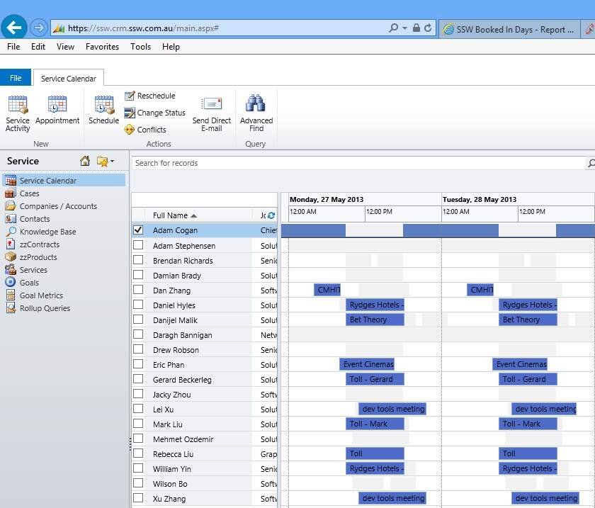

When an Account Manager and a client have made an agreement that a developer will work on a particular project for a day, the dev needs to work on it all day (at least 8 hours), and that should be reflected in his timesheets.

If the dev is booked in on the Service Calendar in CRM, he will be billing that full day to the respective client. Let's see 2 examples:

<!--endintro-->

::: greybox

* Developer X comes in in the morning
* Checks inbox, replies to a few emails, gets a coffee
* Looks at the calendar to see what he’s supposed to work on that day
* Spends some time getting up to speed on the tasks involved
* Then starts billing once he has started work on a specific task for a client

:::
Bad Example: Scenario where developer bills a partial day

::: greybox

* Developer checks his calendar or the CRM Service Calendar the day before and knows what client he’s going to work on before he comes in
* Arrives (with a double shot of coffee) and starts billing as he opens his computer and sets up his development environment
* Works and bills all day regardless of distractions and other people
* Does not stop to wait on someone else because of a dependency, but continues to find ways to deliver value
* The full 8 hours is billed to the client

:::
Good Example: The developer knows ahead of time what he’s working on and bills the full day
The bad example scenario is not acceptable as the full day will be billed to the client as per the agreement, so it's up to him to make sure he is as productive as possible.

The major benefits of the good example (working full days for the client) is that the Service Calendar will be an accurate representation of what will be worked on, and when a client thinks they have a resource booked for a day, they do in fact get the full day.

There will of course be exceptions, such as emergencies or urgent work coming up, but 90% of the time, full days should be billed to 1 client.

::: ok  
  
:::
