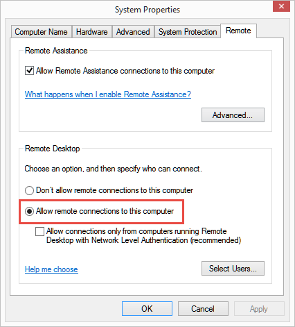

There are a few methods to control a client's machine remotely, all of them have the same functionality, but different usage, and different pros and cons.  

<!--endintro-->

### Desktop support

For supporting end users' workstation machines remotely, here is the order you should try with the end users:

* [Microsoft Teams](https://products.office.com/en-AU/microsoft-teams/group-chat-software) - (recommended)        <dl class="image">  ::: ok      ::: </dl>
* [TeamViewer](http://www.ssw.com.au/ssw/Standards/Support/RemoteSupportViaTeamViewer.aspx)
* [Skype](http://www.skype.com/) - via screen share
* [Skype for Business (previously Lync)](https://www.skype.com/en/business/skype-for-business/)
* [Aeroadmin](https://www.aeroadmin.com/en/)
* [Mikogo](https://www.mikogo.com/) (Free)
* [JoinMe](https://www.join.me/) (Free)
* [UltraVNC](http://www.ssw.com.au/ssw/Standards/Support/RemoteSupportViaUltraVNC.aspx) (Free)

### Servers

For server machines, we recommend using either Windows' built-in Remote Desktop (also knows as "Terminal Services") or a VNC-based tool. Remote Desktop provides each authenticated user a Windows login session that is not shared. If your client lives in a place where the time zone is different, Remote Desktop should be your first choice as it doesn't need the client's interaction once Remote Desktop is enabled (typically it should have been enabled for a server for the ease for remote maintenance and monitoring). For servers, Remote Desktop is usually enabled via a group policy (AD GPO), although it can also be enabled through Windows System Properties.

::: ok  
  
:::

Remote Desktop works for workstations, but it's not recommended due to a security risk if Remote Support isn't disabled. Also, because of the End User License Agreement (EULA), only allows 1 user at a time, if you log in to client's Windows machine, the client will be logged off.

If you can't use TeamViewer, Skype, or Remote Desktop, you can try VNC. There are a number of VNC servers and clients available. VNC-based sessions typically behave as if you're physically using the computer. This means that it shares the same login session with the user who is currently logged on the machine. VNC software allows you to configure a specific username and password for remote access, which means that you don't have to share Windows usernames and passwords or create a temporary Windows user account. Some clients may also prefer this as they can sit in and watch what is happening.

The VNC tools we prefer: [TightVNC](http://www.ssw.com.au/ssw/Redirect/tightvnc.htm) and [Ultra VNC](http://www.ssw.com.au/ssw/Redirect/ultravnc.htm).

Read [SSW Remote Support Standard](http://www.ssw.com.au/ssw/Standards/Support/RemoteSupportSampleScript.aspx).
