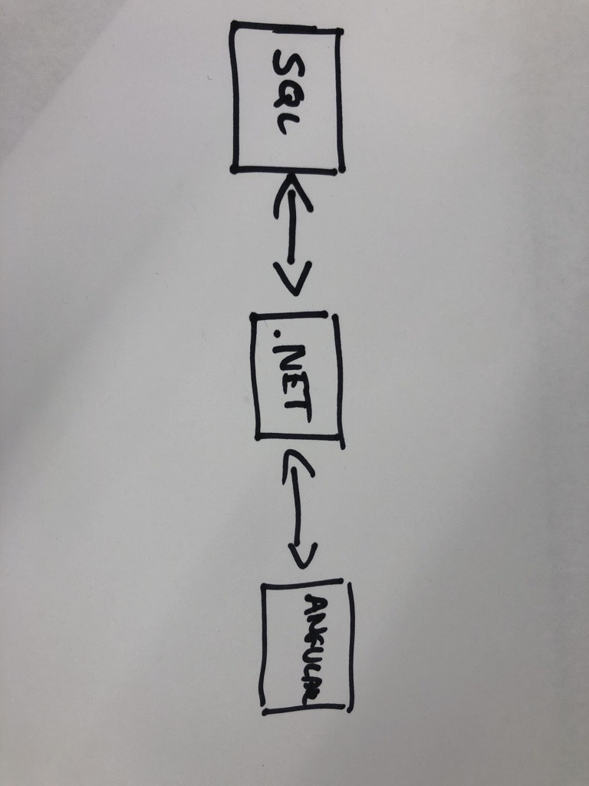
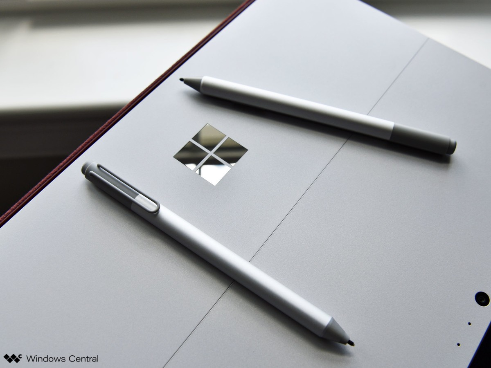
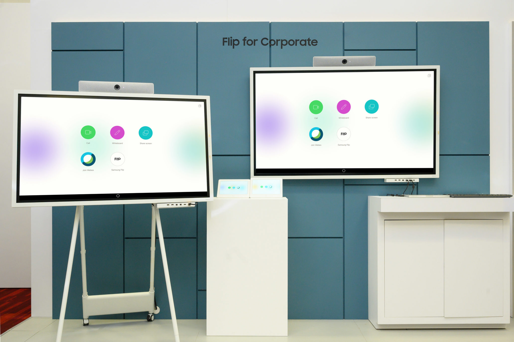
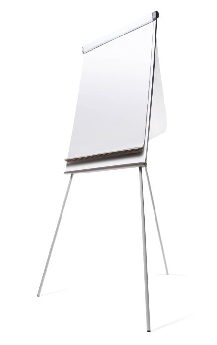

A great way of collaborating with a team or presenting a new solution to a client is using a visual display of your recommendations.

Using a whiteboard is a great way of collaborating and brainstorming which works quite well. But a physical whiteboard is a large ugly object that takes up a fair amount of room, often isn’t kept clean, and doesn’t allow for people to collaborate remotely. There are modern alternatives that work even better, let's have a look at them.

Software consultants often use architecture diagrams to present a solution to the client. These graphical representations are used to help all of the stakeholders, the developers, the designers, and the clients visualize the high-level structure of the system or application to ensure it covers all of the client requirements.

::: bad  
  
:::

::: ok  
  
:::

::: good  
  
:::

<!--endintro-->

### #1 Laptop and cast to a monitor (recommended) ⭐️ 

Using your laptop or Ipad and then sharing your screen in a remote meeting and is easily saveable/sharable for later. There are many apps that allow you to sketch what you're talking about e.g.:

* PowerPoint
* Visio
* OneNote
* [Mural](https://mural.co/) (collaborative app)
* Microsoft Teams Whiteboard
* Microsoft Whiteboard
* diagrams.net (was draw.io) ⭐️ - often collaborative sketches generated above enable the creation of a beautiful architecture diagram ([Do you make awesome documentation?](/do-you-review-the-documentation))

 **Note:** these work fine with a mouse, they work even better with touch screens, or pens/styluses

<dl class="image">        ::: ok      ::: </dl>

`youtube: https://www.youtube.com/embed/qDqtWRu0rTA`

 
 Figure: Using Whiteboard in Microsoft Teams 

`youtube: https://www.youtube.com/embed/JsaqPiqBxPY`

 
 Figure: Using Microsoft Whiteboard App  #2 Tech Whiteboard replacement
* **Samsung Flip** ($3k AUD)
<dl class="image"><dt>
 
                `youtube: https://www.youtube.com/embed/lZgVAbdwYNI` 
                 
</dt><dd> Figure: Using Samsung Flip </dd></dl><dl class="image">  ::: ok      ::: </dl>
* **Microsoft Surface Hub 2** (about $12K AUD)
<dl class="image"><dt>
 
                `youtube: https://www.youtube.com/embed/GSUHgrjwBb4`  
</dt><dd>Figure: Using Microsoft Surface Hub </dd></dl>

### #3 Paper Whiteboard (Low tech – a large piece of paper)

Old school but it is great to have a pen in hand, you can always just grab a big piece of paper and draw on it together.

Bear in mind that paper is not ideal because you can’t wipe it out... you have to start again #ouch

::: ok  
  
:::

### #4 Whiteboard and marker - Low tech (ugly) 

The traditional whiteboard.

Quote from Adam Cogan (apparently not a fan of whiteboards in a tech office):

I believe whiteboards are a sign of an old office… and they are ugly. They’re not a sign of a modern office.
Sometimes they are useful and I know some people really like them (generally older people).
I have seen the digital whiteboards (usually targeted at teachers) but I think they are horrible to use.
The common scenario is for a spec review. I am always happy when I see devs using their device and casting to the TV. And the subsequent notes get saved to Microsoft Teams.

::: ok  
  
:::

### #5 Writable wall -  Low tech (ugly)

Low tech (ugly) – Paint a wall to be writable or put some writable film on an office glass wall

::: ok  
  
:::
