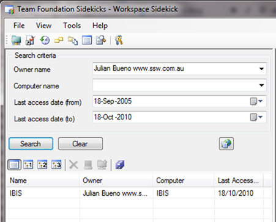

The more workspaces you have the more load the TFS server is under when users check in and out. TFS has to check all of the workspaces for other checkouts of the same files which can be intensive if you have a lot of workspaces.

<!--endintro-->

If a developer had code checked out to a workspace that they have not even looked at in months, what is the likelihood that they even remember what changes they were making?

Why do workspaces build up?* Developers use multiple computers
* Developers use volatile virtual computers
* Developers reinstall their workstation
* Developers get new workstations
* Developers leave

Developer checklist:* Check workspaces often to see what you don't need
* Delete any workspaces you no longer need

TFS Master Checklist:* Delete all workspaces that have not been edited in 6 months
* Warn developers for workspaces that have not been accessed in 3 months

 Figure: Bad example - Rebecca has a workspace that has not been accessed in a while  Figure: Good example - All of Julian's workspaces are current
1. Open VS 2010, File | Source Control | WorkSpaces, click the "Show remote workspaces": <dl><dt></dt>
<dd>Figure: Manage Workspaces </dd></dl>
2. Keep press "Ctrl", select the workspaces which haven't been used for a long time.
3. Click "Remove" button.
