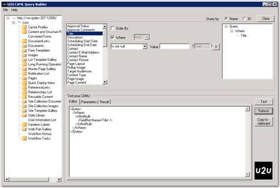

CAML is the XML definition for all things in SharePoint, in deployment, and in creating templates, CAML is the only format.
In SharePoint development, you will also need to know CAML, in particular, how to write a query in CAML.

* Widely used in Content Query Web Parts
* Also used in SharePoint content reports
* In code, used by SPSiteDataQuery object


[Introduction to Collaborative Application Markup Language (CAML)](http://msdn.microsoft.com/en-us/library/ms426449.aspx)
 


[Query Schema](http://msdn.microsoft.com/en-us/library/ms467521.aspx)


<!--endintro-->


```
<Query>
    <OrderBy>
        <FieldRef Name="Modified" Ascending="FALSE"></FieldRef>
    </OrderBy>
    <Where>
        <And>
            <Neq>
                <FieldRef Name="Status"></FieldRef>
                <Value Type="Text">Completed</Value>
            </Neq>
            <IsNull>
                <FieldRef Name="Sent"></FieldRef>
            </IsNull>
        </And>
    </Where>
</Query>
```

          Figure: Example of CAML query   
You can see - CAML is essentially the same as SQL WHERE syntax, but wrapped in an XML format.

Problems with CAML:

1. CAML is XML and is case sensitive – including attributes names. <dl class="badCode">        <dt>
        <pre>&lt;Query&gt;
    &lt;Where&gt;
        &lt;Or&gt;
            &lt;Eq&gt;
              &lt;FieldRef <font color="#400040" style="background-color:rgb(255, 255, 0);">name</font>="Status" /&gt; 
            &lt;Value Type="Text"&gt;Completed&lt;/Value&gt;
            &lt;/Eq&gt;
            &lt;IsNull&gt;
                &lt;FieldRef <font style="background-color:rgb(255, 255, 0);">Name</font>="Status" /&gt;
            &lt;/IsNull&gt;
        &lt;/Or&gt;
    &lt;/Where&gt;
&lt;/Query&gt;</pre>
        </dt>
        <dd>     Figure: Example of CAML query </dd>
    </dl>
2. SharePoint is not good at telling you if you made a mistake with your CAML query. <dl class="badImage">        <br><br>::: bad  <br>  <br>:::<br>
        
    </dl>
3. Hard to debug.
<font color="#ff0000">Tips:</font> Use 3rd Party tools - U2U CAML Query Builder<br>    <dl class="goodImage">        <br><br>::: good  <br>  <br>:::<br>
        
    </dl><font color="#ff0000">Note:</font> U2U CAML Builder is the best tool that we have. There are some occasional UI and interface issues, but for creating CAML and testing it against live SharePoint lists it gets the job done. And it’s FREE!
