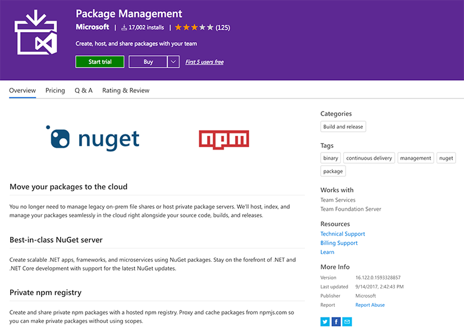

Devs need a way of sharing and consuming the source code or binaries.

VSTS is the best home to put it and share it across their organization because:

<!--endintro-->

* it caches your packages
* it's a centralized place for your packages
* it's constantly evolving (some really cool features are coming...check the video below)

::: greybox
Sharing source or binaries via File Shares or Version Control  
:::

::: bad
Bad example

:::

::: greybox
Sharing source or binaries via 3rd party tools like ProGet, MyGet  
:::

**OK example
** 

::: greybox
Sharing source or binaries via packages created using VSTS Team Build  
:::

::: good
Good example  
:::

::: ok  
  
:::

VSTS is about to add benefits like Component Governance, which allows policies to be set over who can and cannot use the source or binaries E.g. Licensing (MIT might be ok and GPL not ok), security - in development

::: good

Good example: Sharing source or binaries via packages created using Sonatype Nexus.
Already supports Component Governance  
:::

### Additional info 
      

`youtube: https://www.youtube.com/embed/r-nVWDq1QBg`
 

* At 2:50 Mario Rodriguez talks about the bad ways customers share code
* At 6:30 Mario explains to Danijel Malik how VSTS helps with the nasty problem of Diamond Dependencies (aka Binary Consumption Hell)   (E.g. That's when devs are trying to get the new version of say Newtonsoft v1.9 in all projects, but one at a time)
