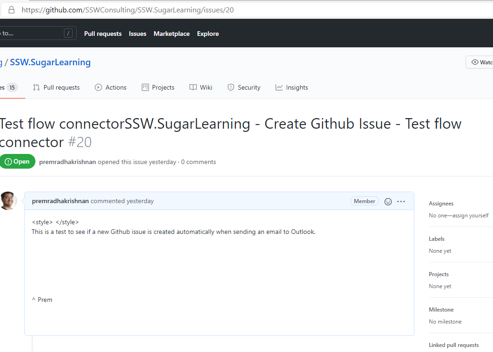
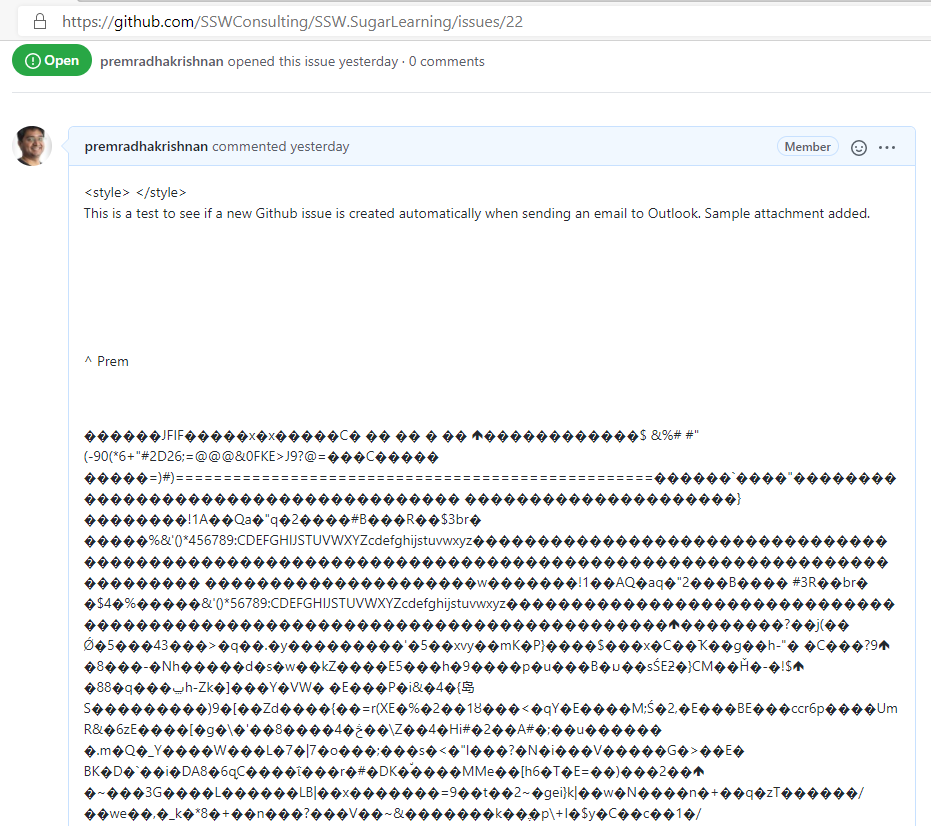

If a Product Owner sends an email to the development team with a request, that email should be turned into a Github Issue before any work is started or the work is prioritized on the backlog. 

Power Automate has a connector to do this automatically when an email arrives in Outlook. It can create a new Github Issue by parsing the From, To, Subject and body of the email. 

However, at the moment there is a limitation that it doesn't read inline attachments in emails and therefore you have to create your issues manually in Github.

<!--endintro-->

<dl class="image">  ::: ok      ::: </dl><dl class="image">  ::: ok      ::: </dl>
🔥Warning: This Flow connector does not suport inline images.

<dl class="goodImage">  ::: good      :::   
      </dl>

 
<dl class="badImage">  ::: bad      :::   
      </dl>

### Related rules

* [Do you know the 3 steps to a PBI?](/do-you-know-the-3-steps-to-a-pbi)
* [Do you know when you use @ mentions in a PBI?](/when-you-use-mentions-in-a-pbi)
