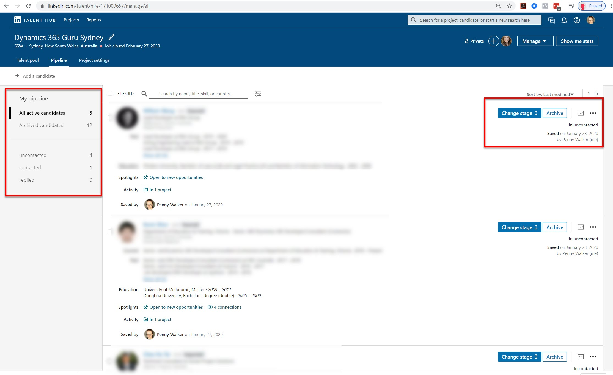

While you can find great candidates in very creative ways, like through events or networking; sometimes you need a little help reaching out. So how can you get an introduction without paying for a recruiter?

<!--endintro-->

The advantage of using a Recruiter to help you find awesome staff, is that they already have access to an excellent network of great people.

LinkedIn is a modern way of meeting new likeminded professionals, but it relies on you knowing someone that they know. With a normal LinkedIn Profile, you can only contact people that are connected with you, or within 2-3 connections. So while standard LinkedIn is great for people you already know, it makes it hard to head hunt anyone new.

This is where LinkedIn Recruiter is a game changer. Some the unique features:

* You can search for people that you do not know using keywords like “NET Developer”, “Sydney”, or “University of Technology”.
* It shows you if people are open to being prospected
* You can look at a profile without the owner knowing
* Post your Ads on LinkedIn and manage your applications
* Manages the application pipeline for you (but it is not customisable like in Talent Hub)
* Gives you applicant suggestions based upon your ads
* Allows you to directly message candidates via InMail

<dl class="ssw15-rteElement-ImageArea"></dl> **Figure: A screenshot of the Recruiter search that you can use. The red box shows you the keyword searches that you can do to filter applicants and suggestions.** 

**Figure: Showing the non-customisable funnels used by LinkedIn Recruiter. You can easily move the candidates from one stage to another, and some of them are automatic like “Contacted” This is triggered by you sending an InMail to a candidate or them replying. If you want a fully customisable funnel, I recommend the ATS LinkedIn Talent Hub.
** 

If you are still having trouble finding great candidates either by searching via keywords, or by posting jobs, here is a great "how to" video from Ross Carvalho from LinkedIn to help you find those hidden golden candidates:

`youtube: https://www.youtube.com/embed/Fm9RbDKmfHg`
