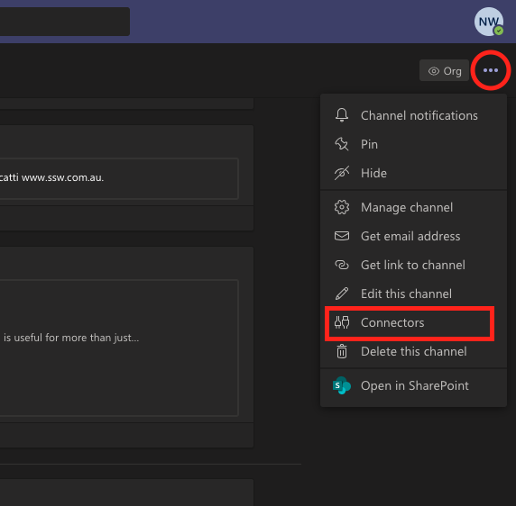
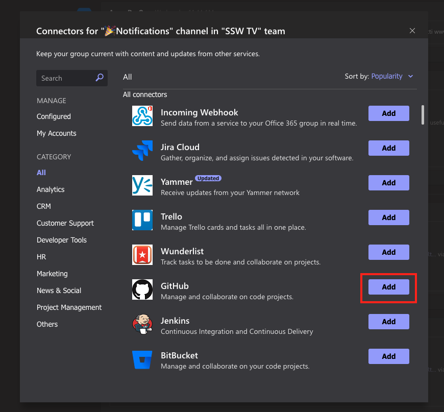

It is important to have a feed of what is happening in your project while still keeping a clean space to have discussions. This is why your Team should always have a Notifications channel.

A majority of these notifications can be created using the connectors that are built into Teams. To create a connection:

* Select the three dots in the top right of the screen and select "Connectors."

 **Figure: This is how you begin the process of adding a connector.** 

* Select "Add" on the connector that you want to use.

 **Figure: This is the pop-up that allows you to select which connector to add.** 

* Give the Connector a name that describes what it does.
* Complete the other configuration options for the Connector and click "Save."

 **
** 

 **Figure: The configuration page for the RSS Connector that notifies of a new video being uploaded to the SSW TV Youtube channel with a name that describes what it does.** 

Sometimes you may have to choose between multiple connectors that can serve the same base purpose. In this situation, it is good to choose the one that provides the important information in the easiest way.

 **Figure: Bad example – There is no thumbnail and no link to the video. (It is nice that you can add custom text – inside the 2 emoijs)** 

 **Figure: Good example – There is a thumbnail and a link to the video. (Although there is no custom text)** 

<!--endintro-->
