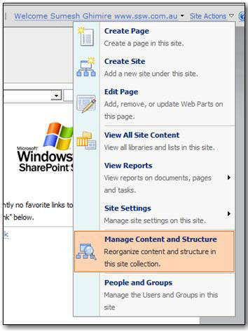
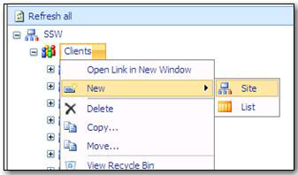
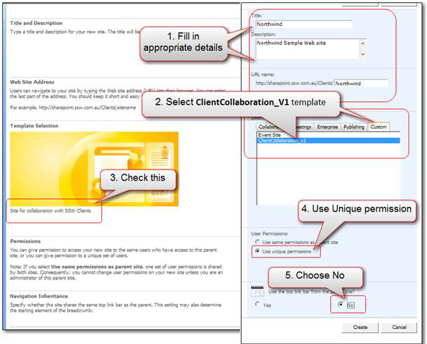
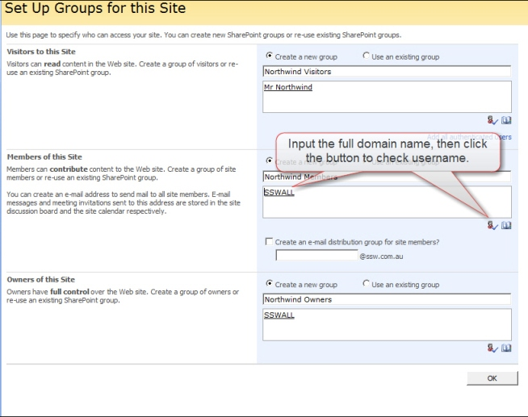
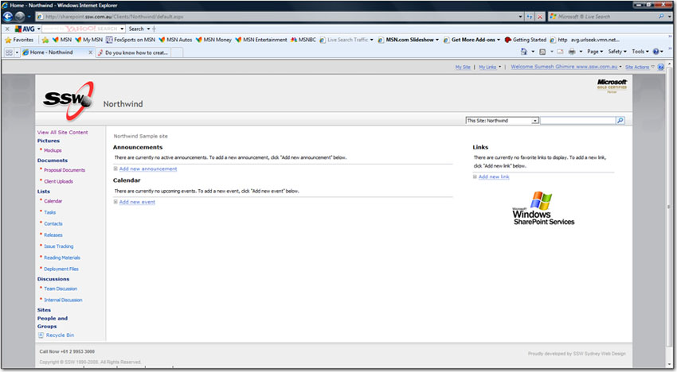

You should do anything that helps a project succeed. The best thing is to enable great collaboration, by giving your customer an awesome 'Customer Portal'.  Then they can see new mockups, comment on features, get new releases and participate in team discussions on their particular project.

So the first thing you should do is to create a 'Customer Portal' in your SharePoint extranet. Then give your customer a login, send them an email and they are now going to really get involved!

There are many means by which you could provide this functionality to your client.

If you are using SharePoint then....

It is advised that you create a customized SharePoint Team Collaboration site template. That way you can very quickly initialize a new site, for each new customer.

Once you have the template, follow these steps to create a customer portal with SharePoint 2007:

<!--endintro-->

1. Go to the root where you want to create a site. E.g. sharepoint.ssw.com.au
2. Click "Site Actions" on right-hand top, select "Manage Content and Structure

Figure: The first step to creating a 'Customer Portal' is to select 'Manage Content and Structure' to view site collection 
Once the new window opens, on the left-hand side, click on the 'Clients' dropdown select New -&gt; Site. 
   Note: If you don’t see this option, that means you don’t have permission to create the site.

Figure: Create new site 
Now follow these steps when the new window opens fill in the fields below.

Figure: Fill in the appropriate info then click "Create" 
More Information:

1. Fill in the fields for the new client site 
eg. Title, Description, and URL
2. Select the template 
e.g “ **ClientCollaboration\_V1** ” in the Custom tab.
Note: Your selection is confirmed in the picture. In this example, the template’s description looks like “ **Site for Collaboration with SSW Clients** ”.
3. Select “ **Use Unique permissions** ” as you need to give the client an account to visit.
4. In the “ **Navigation Inheritance** ” choose “ **No** ” as you don’t need to let client visit the other client sites via the navigation.
5. Click “ **Create** ”

Next step is to setup the groups and permissions.

::: good
Figure: Create a 'new group' or select an 'existing group' for the newly created site  
:::

More Information:

* Permissions: After you created the website for the client project, you need to configure the permission to make sure the developers and the clients can visit the site with the current authority. By default:

1. **Visitors to the site - Read:**
    * Visitors need to read most of the site.
    * They can't read team discussions (not used)
    * They can download from 'release files' document library.
    * They can synchronize their calendar to the team calendar in SharePoint (not used - one day it should read from CRM)
2. **Members of this Site - Contribute:**
    * Can view, add, update and delete.
3. **Owners of this Site - Full Control:**
    * Has a full control.

In this case, we are using 'create a new group' option because we want this group to be able to access only for this particular site  - It is a good practice to create a new group for every site you create, because it will be easier to add or delete users in the group for that specific site.

Note: you can also access this through the "People and Group" option on "Site Action" link on right-hand top of the page if you need to manage permission in future.

Click "OK", and the portal is created.

Figure: Northwind portal

Note: SharePoint will send "welcome email" to all the members of the groups you created for the site with basic information, but you still need to send an email to your customer with the login details like URL, username, and password.
