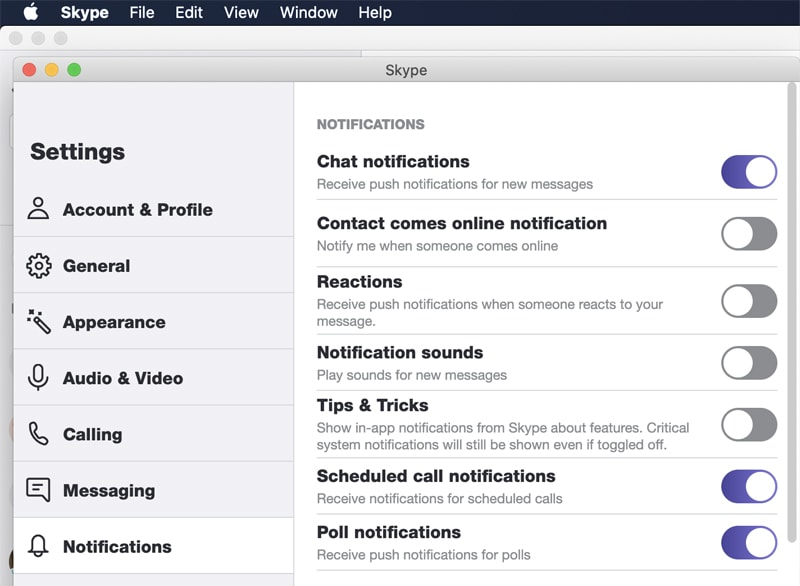

[Dealing with distractions](/_layouts/15/FIXUPREDIRECT.ASPX?WebId=3dfc0e07-e23a-4cbb-aac2-e778b71166a2&TermSetId=07da3ddf-0924-4cd2-a6d4-a4809ae20160&TermId=d65f17a0-2354-4793-9481-7dc2eea0e559) is a fundamental rule to a successful project. Skype is a great way to get distracted. Following these options helps you to minimize messaging/communication distractions: 
<!--endintro-->

1. Set your status to Busy - people will think twice before messaging you
2. Don't display an alert when a contact comes online or goes offline
3. Don't play a sound when you receive an email. Remember - you do need a sound when you receive an IM in case you're not looking at your PC when it arrives.

::: ok  
  
:::

### Related Rules

* If you run Microsoft Teams to communicate with work colleagues you should also [minimize Microsoft Teams distractions.](/do-you-minimize-team-distractions)
* If you run Outlook to manage the email you should also 
      [minimize Outlook distractions](/do-you-minimize-your-outlook-distractions).
