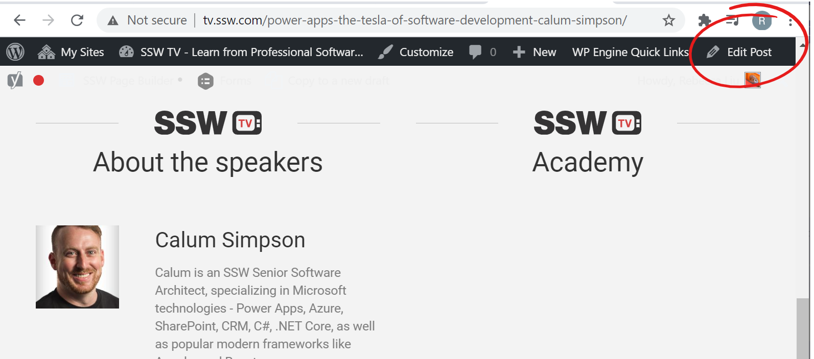
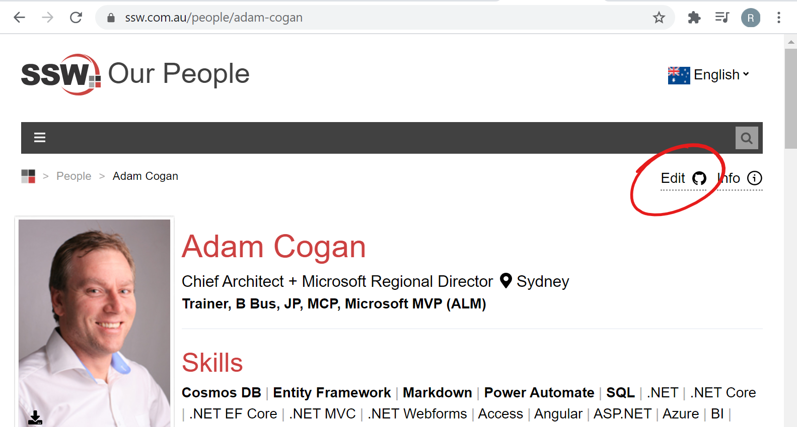

If you have database driven pages on your website, you need a way of updating the data quickly and easily.   **Each page should have an 'Edit' link** - only visible when the site is running internally or in administrator mode - that takes you directly to the page for editing the content on that page.
  The exception to this is if you are using open-source data. [SSW.People](https://ssw.com.au/people/) is a good example of this.

<!--endintro-->

::: ok  
  
:::

::: ok  
  
:::

::: good  
  
:::

From Github, you can edit and submit a pull request. See     https://github.com/SSWConsulting/SSW.People.Profiles/wiki for more details.

This is better than sending a 'Change from X to Y' email ([http://rules.ssw.com.au/do-you-ask-for-content-changes-using-from-x-to-y](/do-you-ask-for-content-changes-using-from-x-to-y)) as the work can be done immediately with less work and management requirements.

### Related Rule

::: ok  
  
:::
