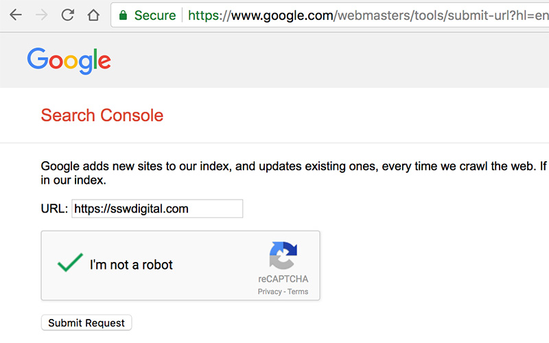
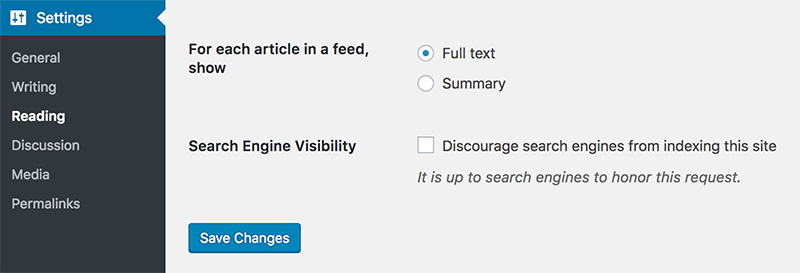

First things first. Check if your web page has been indexed by Google. Don't be surprised if Google is already one step ahead of you - its Google bots could have already crawled your site without you knowing. So what's the best way to find out if Google has indexed your web page? Just search for its exact link.

<!--endintro-->

If you can't find it, go to [Google's Search Console](https://www.google.com/webmasters/tools/submit-url) and submit your URL.

::: ok  
  
:::

**Note:** Internal pages should be crawled automatically, so you only need to inform the root of the site.

### WordPress 
   

If your website is built on WordPress, make sure you have unselected the "Discourage search engines from indexing this site" option. This can be found under      **Reading Settings** :

::: ok  
  
:::
