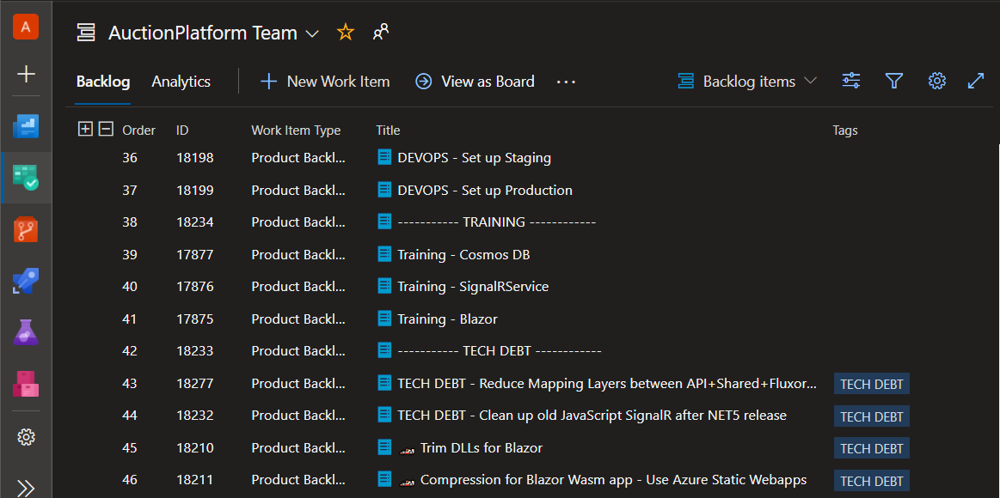
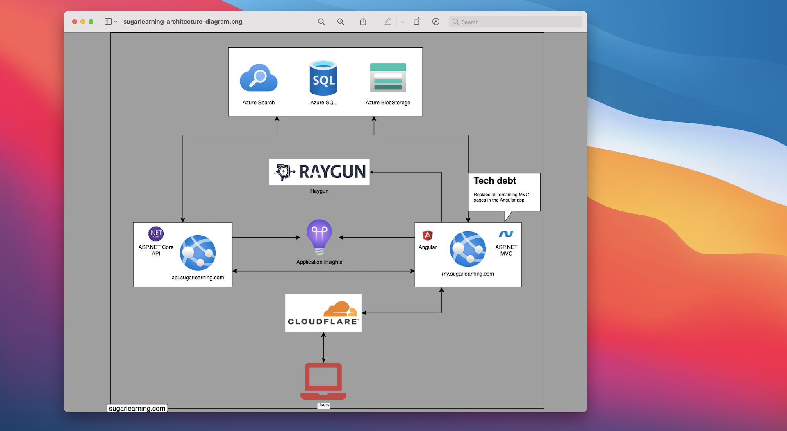

### What is Technical Debt?

Technical Debt is when you take a shortcut to get a feature in to get some feedback.

`youtube: https://www.youtube.com/embed/ASVD4YIOgpU`
 

<!--endintro-->

Code that is hard to understand after reading it multiple times or a single method that spans multiple screens is also considered to be Technical Debt.

Systems need to have features added to them to continually remain useful (or competitive).

As new features are added to the system, often more Technical Debt will be introduced.

**Example:** A developer takes a shortcut to get some early feedback on a new feature

* $100 - full feature
* $20 - feature with shortcuts (no tests, dirty code, whatever it takes)
* $80 - IOU via PBI in the backlog e.g. [FeatureName] – Tech Debt - Planned

::: good  
  
:::

### What are the consequences of Technical Debt?

* Fewer features overtime for the customers
* More molasses (developer friction) for the developers

### The 2 types of Technical Debt

 **#1 Planned Technical Debt** 
Sometimes you do want to quickly implement a new feature to get it out and receive some feedback.

::: greybox
PBI:         **[FeatureName] – Tech Debt - Planned** 

:::

**Note:** Martin Fowler calls this Deliberate Technical Debt 

 **
** 

**#2 Discovered Technical Debt** 
During a code review, you or the team notice something as part of the system that is clearly Technical Debt. This code is hindering the ability to add new features or is hard to read/understand.

::: greybox
PBI: 
             **[FeatureName] – Tech Debt - Discovered** 
:::

**Note:** Martin Fowler calls this Inadvertent Technical Debt

### How to repay Technical Debt

Just like a business that receives pre-payment from customers, a software team should be reviewing the size of their liabilities (being the list of PBIs with Technical Debt).

At the Sprint Planning:

1. Show the Product Owner the list of outstanding Technical Debt PBIs
2. The Product Owner should make sure that the developers review the list of Technical Debt list and pick at least 1 PBI to pay back during the upcoming sprint

### Screenshots

::: ok  
  
:::
<dd></dd>

::: ok  
  
:::
<dd></dd>

::: ok  
  
:::
<dd></dd>
### Related Rule

* [Do you refactor your code and keep methods short?](/refactor-your-code-and-keep-methods-short)
