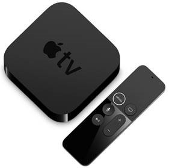
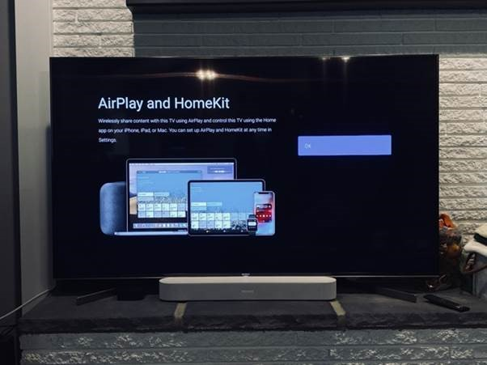
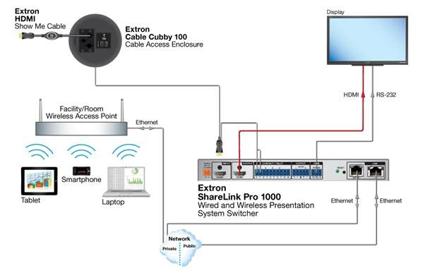
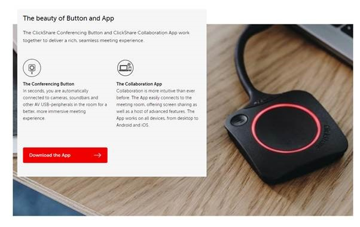

There are several ways you can set up your boardroom AV for effective and efficient conferencing.

<!--endintro-->

### Apple TV

A popular way to connect devices wirelessly to the boardroom TV is to use an Apple TV.

::: ok  
  
:::

::: good
Pros

:::

* It allows you to connect any Apple device including iOS.
* Easy to use for Apple users
* Can be easily added to an AV automation system, e.g. Control4, Savant, etc. which allows you to display on any other display connected to the same AV system
* Inexpensive way of adding wireless connectivity to an existing system

::: bad
Cons  
:::

* Only works with Apple devices
* Not designed for corporate networking (can’t have both guest access and secured network at the same time)
* Guest need to be on a corporate network to connect

### Smart TV’s with built-in AirPlay, Google and HoMirrorcast
A newer way to connect wirelessly is to use Smart TV’s built-in features.

::: ok  
  
:::

::: good
Pros

:::

* Allows you to wirelessly connect any Apple device including laptop and IOS
* Can connect Windows laptops through Mirrorcast
* Can also connect Android devices through Google Home

::: bad
Cons

:::

* Not all Windows laptops have Mirrorcast capability
* Not designed for corporate networking (can’t have both guest access and secured network at the same time)
* Guest need to be on a corporate network to connect
* Display can not be shared across multiple screens in an automated AV setup, e.g through Control4

### Extron

For a more robust AV solution, you can install an Extron system. We recommend the ShareLink Pro.

::: ok  
  
:::

::: good
Pros

:::

* Allows you to wirelessly connect any device
* Also has an HDMI through connection so you can connect both wired and wirelessly
* IT-friendly with monitoring tools and dual networking options, allowing for guests to connect without hassle
* Can integrate as part of an AV automation system, e.g. Control4 or even Extron’s own
* Extron support and reliability is highly rated

::: bad
Cons

:::

* You \*need\* to install an app, users can’t just connect and display something wirelessly without it
* Expensive

### Barco Clickshare

A more advanced wireless solution, Barco Clickshare allows you to use any laptop device without installing software by connecting a small USB dongle. The Clickshare 'brain' is connected to your TV or AV hub via HDMI.

::: ok  
  
:::

::: good
Pros

:::

* Allows you to wirelessly connect any smartphone via an app
* Both windows and apple laptops can connect via the included USB dongle
* Can have multiple users connected at once, and switch between them by pressing the present button on the dongle
* IT-friendly with lots of controls and security features

::: bad
Cons

:::

* Compared to a wired HDMI signal, the video will not play super smoothly all the time (bad if you’re playing back videos for review)
* Can easily lose the dongles if staff and guests are not careful
* Most expensive option (can be around 8K AUD for the 4k version)
