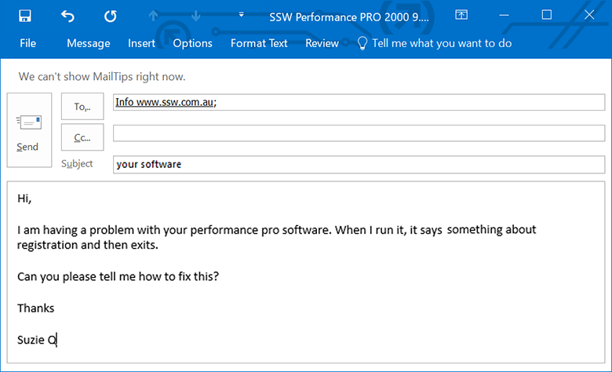

When reporting bugs and giving product feedback, it is essential that you are as descriptive as possible, so that the developer can reproduce the error to find out what the problem is or understand what features you are requesting.

Try to be as efficient as possible:

1. If there is a GitHub backlog, add an issue and @mention relevant people
2. If there is a Azure DevOps backlog, add a PBI and @mention relevant people
3. If you don't know where the backlog is, or don't have access, then send an email

Try to have one issue/PBI/email per bug/suggestion, but if the bugs/suggestions are related or very small (e.g. they are all on the same page) then you should group them together in a single email.

<!--endintro-->

::: bad  
  
:::

::: good  
  
:::

A great template to follow is the [Functional Bug template](https://github.com/aspnet/Home/wiki/Functional-bug-template) from the ASP.NET open-source project. Spending time to provide as much detail as possible, by ensuring you have the three critical components of: Steps to reproduce, Expected outcome, and Actual outcome, will save the both you and the developer time and frustration in the long run. 

Also, make sure your descriptions are detailed and useful as that can make finding the solution quicker and easier.

Make sure you always explain and give as many details as you can of how you got an error or a bad experience.

::: greybox

Hi, Rebecca, 

               
Where is SSW TV on the navigation?

- Adam  

  
:::
<dd>Figure: Bad example - Lack of details</dd>

::: greybox

Hi, Rebecca,

<ol><li>Navigated to ssw.com.au</li><li>Scrolling down looking for a big graphic like "CHECK OUT SSW TV! CLICK HERE!"
(Nothing)
Me, thinking… "Hmm… let's try the menu at the top..."</li><li>About Us? Nope.</li><li>Services? Nope.
</li><li>Products and Support? Nope.</li><li>Training? Nope.</li><li>User Group? Nope.</li><li>Rules? Nope.
Me, thinking... "OK. Now where? Most likely, the SSW company description will list it..."</li><li>Navigates to About Us.</li><li>Me, scrolls down… nothing.
Me, thinking... "OK. Weird. Let's go back."</li><li>Me, goes back to homepage.
Me, thinking… "Is there a site map?"</li><li>Scrolls to bottom of page. Clicks sitemap link.
Me, thinking... "Ctrl+F for TV? Nope."</li><li>Me, gives up… types tv.ssw.com.au to try and get lucky. Huzzah!</li></ol>
- Adam 

  
:::
<dd>Figure: Good example - We can easily identify more the one way to improve the UX</dd>
Better than a good description of the bug is a screen recording. This should be followed for a more detailed report. Use [Snagit](http://www.techsmith.com/snagit.html) or [Camtasia](/production-do-you-know-how-to-start-recording-with-camtasia) to record your screen.

`youtube: https://www.youtube.com/embed/y9vsGY1hYN0`
 

::: good
Figure: Good example - Recording bug reports in a video can make the issue clearer to see

:::

`youtube: https://www.youtube.com/embed/VDZSfHJ7GNU`
 

::: good
Figure: Good example - Giving feature requests via video

:::

::: greybox
 **Who should you email, the Product Owner or the Tech Lead?
** 
It depends on the team, but often the Product Owner is busy. If you know the Tech Lead and your suggestion is obviously a good one and not too much work, then you should email the Tech Leader and CC the Product Owner.
The Product Owner can always respond if he doesn’t like the suggestion.
e.g.
For a bug email:   TO: TechLead@  CC: ProductOwner  Subject:BUG xxx   (or use PBI @mention)
For a new feature email:  TO: TechLead@  CC: ProductOwner  Subject:SUGGESTION xxx  (or use PBI @mention)
Note: There is no use for: sswtimepro@ssw.com.au

:::

When you create a bug/suggestion to a backlog, it's important to add an emoji in the title so it looks nicer.
I.e: "🐛 Bug - Calendar is not showing on iOS devices" 
"✨Feature - Add 'Back to menu' item to top navigation"

### Related rules

* [Reporting a Bug or Enhancement](http://www.ssw.com.au/ssw/Standards/Support/bugreportorenhancement.aspx)
* [Do you provide details when reporting .NET Applications errors](/do-you-provide-details-when-reporting-net-applications-errors)
