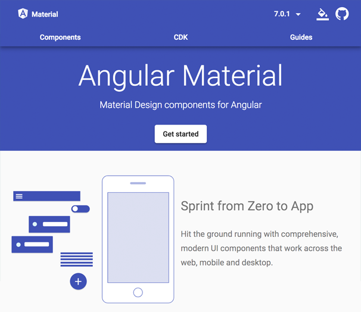
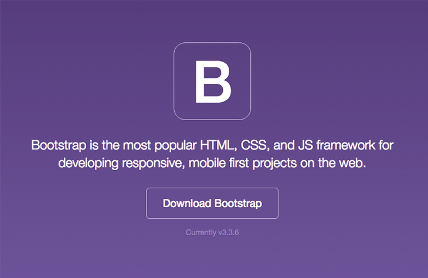

The main contenders for the best UI framework for Angular are:

* **Angular Material** - https://material.angular.io/
* **Bootstrap** - [https://getbootstrap.com](https://getbootstrap.com/)


Making the choice of which to use will depend on several factors related to your project:

1. The look and feel of the site that your client is seeking
2. The range of components that will be required in the application
3. The developers' familiarity with the framework
4. The designers' familiarity with theming in the framework


<!--endintro-->

### Angular Material

Angular Material has a very specific design metaphor, and if the look and feel is one that your client likes, then consider using it. But if the Material metaphor doesn't match the rest of the client's applications, then it may not be a good choice.


::: ok  
  
:::

The components available in Angular Material are solid, but it doesn't have the range of components that are available in Bootstrap. It is actively being developed though, and new, exciting components are being added regularly. For example, an infinite scroll component was added in October 2018.

Angular Material uses Angular components for its widgets. This means that the HTML rendered in the browser will include directives, divs, and classes that are not present in the component template HTML. It is for this reason that Designers without a good understanding of Angular may have difficulties tweaking the look of the Angular Material components.

Here are some tips for working with Angular Material:

* Information regarding theme can be found here: https://material.angular.io/guide/theming
* Tweaking individual components can be done by wrapping it in a CSS class and using ng-deep: <br>      https://blog.angular-university.io/angular-host-context/
If you prefer, all such modifications can be done in a separate SCSS file that is then added into styles.scss.
Make sure you use a wrapper class so you do not change all other same Angular Material components in the project.
* Add the <br>      [Flex Layout](https://github.com/angular/flex-layout) library to your project to take advantage of <br>      [Flexbox](https://css-tricks.com/snippets/css/a-guide-to-flexbox/%22%20%5co%20%22https://css-tricks.com/snippets/css/a-guide-to-flexbox/).  It makes it easy to use Flexbox classes via directives in your Angular HTML templates.
Here is a demo website for Flex Layout: <br>      [https://tburleson-layouts-demos.firebaseapp.com/#/docs](https://tburleson-layouts-demos.firebaseapp.com/%22%20%5cl%20%22/docs)
* For the creation of custom Angular Material components, the CDK can be used: https://material.angular.io/cdk/categories
* If you need additional colours for the standard 'warn', 'primary', and 'accent', you can add that into global SCSS files: <br>      


```
.mat-success {  color: $white !important;  background-color: $success !important;}
```


Now you can do following: <br>      


```
<button mat-raised-button color="success">Primary</button>
```


### Bootstrap

Bootstrap is the obvious choice if your UI design requires extensive customization. Bootstrap makes it easy to theme your application's design and to tweak the design of individual components. In addition to components, Bootstrap 4 provides powerful layout and theming capabilities. These features make it popular with Designers.


::: ok  
  
:::

There are two popular bootstrap-based Angular component libraries -     [ng-bootstrap](https://ng-bootstrap.github.io/) and     [ngx-bootstrap](https://github.com/valor-software/ngx-bootstrap). Both support Bootstrap 4 and provide a rich choice of components.
