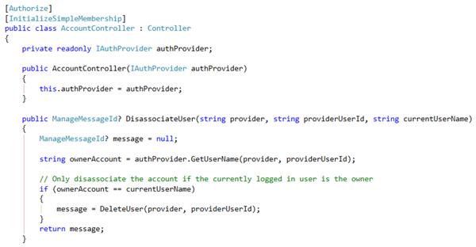

Using a precision mocking framework (such as Moq or NSubstitute) encourages developers to write maintainable, loosely coupled code.

Mocking frameworks allow you to replace a section of the code you are about to test, with an alternative piece of code.
 For example, this allows you to test a method that performs a calculation and saves to the database, without actually requiring a database.

<!--endintro-->

There are two types of mocking framework.

### The Monster Mocker (e.g. Microsoft Fakes or TypeMock)

This type of mocking framework is very powerful and allows replacing code that wasn’t designed to be replaced.
 This is great for testing legacy code, tightly coupled code with lots of static dependencies (like DateTime.Now) and SharePoint.

::: bad  
  
:::

### The Precision Mocker (e.g. Moq)

This mocking framework takes advantage of well written, loosely coupled code.

The mocking framework creates substitute items to inject into the code under test.

::: good  
  
:::

::: good  
  
:::

::: good  
  
:::
