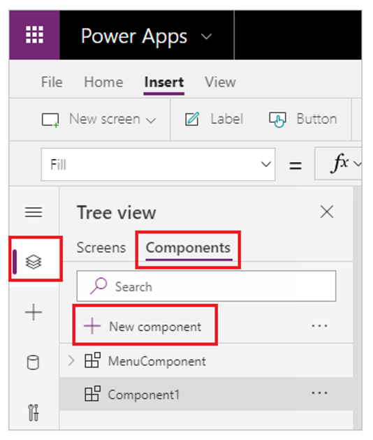

Canvas Apps have many controls out of the box that will work for most scenarios, for example, you would like to create a custom control that combines a text box and two buttons (+ and -) to create a spinner control. You could do this by placing two buttons next to a text box on the form. Problem solved, but what about next time that same control is needed?

<!--endintro-->

That's where Components come in. Components allow you to create a custom control once then re-use the control repeatedly in your App. It's great for consistency, and any time you edit the component definition those changes will be applied to every instance of the control.

For more information on Components look at the following blog post: https://powerapps.microsoft.com/en-us/blog/components-available-in-preview/

Full documentation here: https://docs.microsoft.com/en-us/powerapps/maker/canvas-apps/create-component

::: ok  
  
:::
